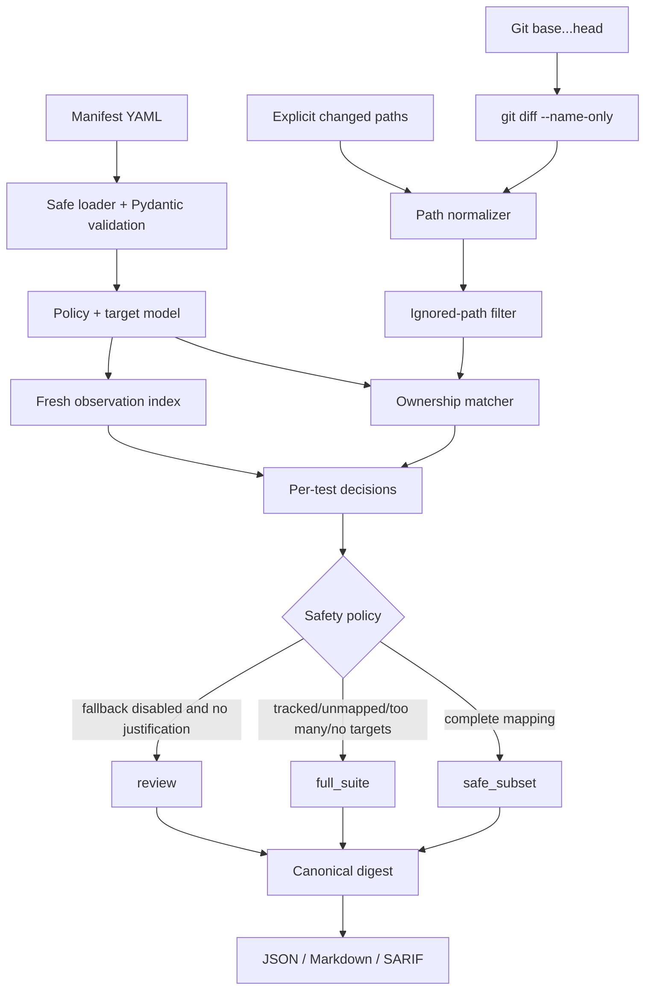

# ImpactWeave 0.3 Architecture

## System boundary

ImpactWeave is a deterministic library and CLI. It receives a manifest, a list of changed relative paths or a Git diff reference pair, and optional bounded observations. It emits a test plan and never executes the commands named by the manifest. This boundary makes the core suitable for local development, GitHub Actions, and other CI providers without granting the planner authority over the repository.

## Components

| Component | Responsibility | Trust level |
|---|---|---|
| Manifest loader | Safe YAML parsing, size bounds, schema validation, reference checks | Untrusted input boundary |
| Path normalizer | Normalize separators and reject absolute/traversal/NUL paths | Security boundary |
| Git reader | Execute only `git diff --name-only` with argv and timeout | Local tool boundary |
| Ownership matcher | Match changed paths against deterministic POSIX globs | Pure function |
| Observation index | Discard stale observations and retain only test/path/source metadata | Untrusted evidence |
| Safety policy | Apply ignored, tracked, max-selected, and fallback rules | Pure function |
| Decision builder | Produce per-test selection, reason, matched paths, and sources | Pure function |
| Digest builder | Canonicalize report with artifact digest blanked | Pure function |
| Reporters | Render JSON, Markdown, SARIF 2.1.0 | Serialization boundary |
| CLI | Validate arguments, choose path source, write artifact, return exit code | User I/O boundary |

## Data flow

## Error flow

User input errors are reported before planning: malformed YAML, unknown observation IDs, duplicate target IDs, unsafe paths, invalid Git refs, and incompatible CLI options. Git failures propagate as controlled command errors without a partial plan. A valid plan with an uncertain mapping is not an exception; it is a `full_suite` verdict with `fallback_reasons`. A caller can therefore distinguish infrastructure failure from a conservative safety decision.

| Condition | Engine behavior | CLI intent |
|---|---|---|
| Malformed manifest | Raise `ValueError` with validation context | Non-zero input error |
| Absolute or traversal path | Reject before matching | Non-zero input error |
| Git command failure | Propagate subprocess error | Non-zero infrastructure error |
| Tracked path changed | Select all declared targets | Zero; caller should run full suite |
| Unmapped path and fallback enabled | Select all declared targets | Zero; safe fallback |
| No targets | Full-suite verdict with empty target list | Zero; caller must decide how to execute |
| No justification and fallback disabled | `review` verdict | Exit 1 |

## Configuration and compatibility

The existing Nexus fields remain supported. New fields are optional: `tests`, `test_observations`, and `test_policy`. This permits incremental adoption and allows existing repositories to keep using contract impact analysis while adding test planning. Schema versioning is explicit in the emitted report. Future manifest changes must add migration notes and fixtures rather than silently changing verdict semantics.

## Logging and observability

The core library does not emit logs by default and never sends telemetry. The CLI's primary observability surface is the report itself: selected/skipped counts, changed paths, unknown paths, reasons, evidence sources, policy values, and artifact digest. A future `--verbose` mode may emit structured diagnostics to stderr, but it must not print command environment or test output. CI systems can archive JSON and SARIF artifacts and correlate them through the digest.

## Security model

The planner treats manifests, paths, and observations as untrusted data. YAML uses safe loading and existing byte limits. Paths are normalized as POSIX paths, reject NUL and traversal, and remain relative. Git refs are rejected if they begin with `-`; subprocess execution uses a list and no shell. Declared test commands are never executed. A manifest cannot load plugins, interpolate shell expressions, request network data, read environment variables, or cause a checkout.

The planner's selection contract is not a sandbox and not a security proof. A downstream executor remains responsible for sandboxing, timeouts, least privilege, dependency installation, and secrets. The project states this limitation in every user-facing workflow example.

## Performance strategy

The planner is O(C × P + T × P + O), where C is changed paths, P is the average number of path patterns per target, T is target count, and O is observation metadata. Matching is deterministic and bounded by manifest limits; Git output is capped at 2 MB. The core has no network or database latency. For large repositories, a future indexed matcher can replace the naive matcher behind the same pure interface.

## Scalability strategy

The MVP scales vertically in a CI job and horizontally through the caller's test runner, not through an internal worker queue. Test targets are emitted as independent argv arrays, making sharding possible without changing the plan format. A later `groups` field can encode stable shard keys, while the report digest remains independent from machine count.

## Testing strategy

Unit tests cover path safety, glob matching, target validation, ignored and tracked policies, stale observations, deterministic digests, fallback semantics, and report serialization. Integration tests create a temporary Git repository and verify that only file names are read. Golden fixtures cover safe subset, ignored-only, unknown, tracked, and max-selected scenarios. Future property-based tests should assert that no accepted path escapes the repository and that adding an unmapped path never narrows a plan under fail-safe policy.

## MVP, advanced, and future

The MVP is the current CLI/library with explicit paths and Git diff input, deterministic ownership matching, optional fresh observations, conservative policy, JSON/Markdown/SARIF, tests, fixtures, and GitHub Actions integration. Advanced features are optional adapters for coverage.py and LCOV, OpenAPI/AsyncAPI/JSON Schema diff sources, JUnit history import, GitHub Checks summaries, and an indexed matcher for very large manifests. Future work may explore remote evidence or learning-based ranking only behind an explicit opt-in and with a full-suite safety invariant; it is not part of the trust-critical core.
